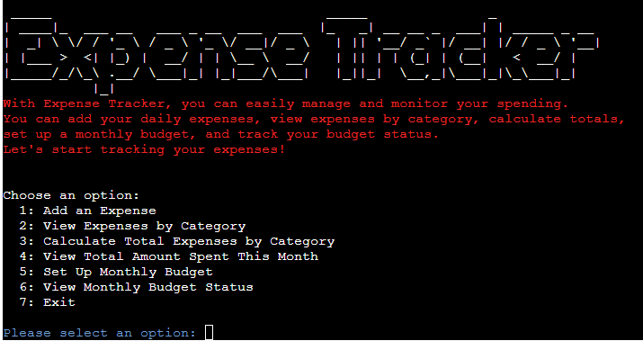

# Expense Tracker

Expense Tracker is a Python-built application that seamlessly integrates with Google Sheets via API, providing users with a streamlined solution for tracking and controlling their monthly expenses. The app has a user-friendly interface, real-time data synchronization, and insightful visualizations, empowering individuals to make informed financial decisions while ensuring the security of their sensitive information. By analyzing spending patterns and setting budget goals, Expense Tracker offers a convenient and secure way to manage finances in the digital era.
The app was inspired by the traditional pen-and-paper method and offers a digital solution that leverages the power of technology to streamline expense tracking and financial management.

[Live Website](https://expense-tracker-at-fd85a26ed02d.herokuapp.com/)

[Github Repository](https://github.com/terintealexandrin18/exptrack)

