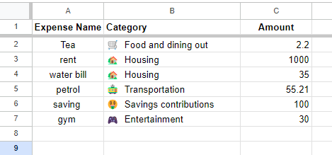

# Expense Tracker

Expense Tracker is a Python-built application that seamlessly integrates with Google Sheets via API, providing users with a streamlined solution for tracking and controlling their monthly expenses. 

The app has a user-friendly interface, real-time data synchronization, and insightful visualizations, empowering individuals to make informed financial decisions while ensuring the security of their sensitive information. By analysing spending patterns and setting budget goals, Expense Tracker offers a convenient and secure way to manage finances in the digital era.

The app was inspired by the traditional pen-and-paper method and offers a digital solution that leverages the power of technology to streamline expense tracking and financial management.

[Live Website](https://expense-tracker-at-fd85a26ed02d.herokuapp.com/)

[GitHub Repository](https://github.com/terintealexandrin18/exptrack)

## Table of Contents
- [1 User Experience](#user-experience)
    - [Project Goal](#project-goal)
    - [User Stories](#user-stories)
- [2 Design](#design)
    - [Page Layout](#page-layout)
    - [Color Scheme](#color-scheme)
    - [Flowchart](#flowchart)
- [3 Features](#features)
    - [Existing Features](#existing-features)
    - [Future Features](#future-features)
- [4 Technologies](#technologies)
    - [Languages Used](#languages-used)
    - [Frameworks, Libraries and Programs Used](#frameworks-libraries-and-programs-used)
- [5 Testing](#testing)
    - [Bugs](#bugs)
        - [Unfixed Bugs](#unfixed-bugs)
        - [Fixed Bugs](#fixed-bugs)
    - [Code Validation](#code-validation)
    - [Compatibility](#compatibility)
    - [Manual Testing](#manual-testing)
- [6 Deployment](#deployment)
- [7 Credit](#credit)
- [8 Acknowledgments](#acknowledgments)

## 1 User Experience

### Project Goal
 - To build an app that is user-friendly and requires minimal instructions.
 - To ensure easy navigation throughout the app.
 - To implement a database that can store user input.
 - To incorporate input validation to prevent incorrect data entry.
 - The program should run continuously until the user decides to stop it.

### User Stories
- As a user, I want to understand the process of the app.
- As a user, I want to be able to view the expenses that have been added.
- As a user, I want the ability to add more expenses without having to open the app every time.
- As a user, I want to be able to enter only valid data.

## 2 Design

### Page Layout
 - The Expense Tracker app boasts a well-structured command-line interface, featuring clear user prompts, engaging ASCII art, and a logical menu structure, providing users with an intuitive and visually coherent platform for effective expense tracking and financial management.

 ### Color Scheme
- The app's color scheme enhances both its visual appeal and functionality by using consistent color-coding for different types of messages. This provides clear visual cues and improves the user experience.
 - Color BLUE - represents user input.
 - Color GREEN - represents success, invalid input or errors, guiding the user to provide the correct type of information.
 - Color RED - represents a warning message, and this helps to draw attention to a potential budget deficit. 
 - Color WHITE - represents default text color.

### Flowchart

## 3 Features

### Existing Features

Google Sheet:
 - User expenses are stored in a Google Sheet. Currently, the app does not support multiple user logins and passwords, so the data is cleared each time the app is running.

    

Title:
 - The Expense Tracker application starts with an eye-catching tile created with ASCII art. This introduction is not only visually appealing but also serves to explain the purpose of the app, enhancing the user experience. It creates a positive and engaging environment for expense tracking, making it more enjoyable for the user.

    

Expense Category Selection:
 - Simplifies expense entry by providing predefined categories with emoji icons, making it faster and more user-friendly. Emoji icons also improve accessibility for users who prefer symbols over text.
 
    

 View Expenses by Category:
 - By analysing spending in specific categories, users can better manage their expenses and budgets and track where their money is going.

    

 Total Expenses by Category:
 - Offers users insights into their spending patterns by displaying total expenses in different categories, facilitating better financial awareness.

    

 View Total Amount Spent This Month:
 - The feature provides users with a comprehensive overview of their monthly spending, promotes financial awareness, and facilitates informed and timely decision-making.

    

 Set up Monthly Budget:
 - Users can set up a monthly budget for their expenses, contributing to financial planning, spending limits and tracking.

    

 View Monthly Budget Status:
 - The application calculates and displays the monthly budget left, total amount spent, and daily budget. It provides warnings for budget deficits and encourages users to stay within their budget.

 - Budget > Total Expenses

    

 - Budget < Total Expenses

    

### Future Features

- Create an interactive budget planning tool that helps users allocate funds to various categories based on their priorities and financial goals.
- Allow multiple users (e.g., family members or partners) to collaborate on a shared budget. This can be particularly useful for households managing finances together.
- Set up alerts and notifications to inform users when they are approaching or exceeding budget limits. This proactive approach helps users stay on track with their financial goals.
- Provide visual analytics and insights into spending patterns over time. Graphs, charts, and reports can help users understand trends and make more informed financial decisions.
- Enable users to create custom budget categories based on their specific needs. This allows for a more personalized budgeting experience.

## 4 Technologies

### Languages Used

 - [Python3](https://en.wikipedia.org/wiki/Python_(programming_language)) - Used for writing the Expense Tracker code.

### Frameworks, Libraries and Programs Used

- Libraries:
    - gspread - This library is used for accessing Google Sheets API. It allows to interact with Google Sheets and perform operations such as reading and writing data.
    - calendar - This is a standard Python library for working with dates and calendars. Used in the app to get the number of days in the current month.
    - datetime - This is a standard Python library used for working with dates and times. Used in the app to get the current date and time.
    - google.oauth2.service_account - This library provides tools for working with Google service accounts. Used in the app to load Google Sheets credentials from a service account file.

- [CODEANYWHERE](https://codeanywhere.com/) - Used for writing the code, committing and push it to GitHub.
- [GITHUB](https://github.com/) - Used to store the project after finishing writing in Codeanywhere.
- [HEROKU](https://dashboard.heroku.com/) - Used to deploy the app.
- [ASCII ART](https://www.asciiart.eu/text-to-ascii-art) - Used to generate the title of the app "Expense Tracker".
- [LUCIDCHART](https://www.lucidchart.com/pages/) - Used the create the flowchart.
- [PEP8CI](https://pep8ci.herokuapp.com/) - Used to validate the Python code.
- [WEBFX](https://www.webfx.com/tools/emoji-cheat-sheet/) - Used to copy the emoji into my code.

- Program Used:
    - SNIPPING TOOL - Used for screenshot and snipping.
    - PAINT - Used to combine the snipped images   

## 5 Testing

### Bugs
 
#### Unfixed Bugs 

- No unfixed Bugs

#### Fixed Bugs

- Currently, there are no unresolved bugs in the project. However, while working on the project, I encountered an issue with the "View Monthly Budget Status" function, which was not functioning properly. After some investigation, I discovered that it required the "View Total Amount Spent This Month" function to be run first. In order to fix this, I added some global variables to the code, which now allows the "View Monthly Budget Status" function to be used in any order the user prefers. Once the budget is added, the function will display the correct value.

### Code Validation

- The code was validated by [CI Python Linter](https://pep8ci.herokuapp.com/). Code is clear, no error found.

### Compatibility

- Browser Compatibility. The python app has been tested on the following browsers:

|Name of the Browser|Compatible ✓ / Incompatible ✕ |
|--|--|
|Google Chrome|✓ |
|Internet Explorer| ✓|

### Manual Testing

| What Has Been Check | The Outcome  | Image With Check| Pass/Fail |
|--|--|--|--|
|Main Menu| Check if can submit different characters which are not in menu and if loop is working||✓ |
|Add Expense: Name|Check if the form can be submitted with empty fields and with a combination of letters and numbers.||✓ |
|Add Expense: Amount|Check if the form can be submitted with empty fields and a combination of letters and numbers.||✓ |
|Add Expense: Category|Check if the form can be submitted with empty fields and selecting a no listed number.||✓ |
|View Expenses by Category|Check if the form can be submitted with empty fields and choosing a different number no listed and if the loop is working. ||✓ |
|Calculate Total Expenses By Category| Check if can view expense categories with their respective total amounts, but only for categories with associated expenses.||✓ |
|View Total Amount Spent This Month| Check if can view the total expense amount.||✓ |
|Set Up Monthly Budget| Check if the form can be submitted with empty fields or with letters. ||✓ |
|View Monthly Budget Status| Check the customized message and status for Budget > Expense, Budget < Expense, and No budget set up.|   | ✓ |
|Exit| Check if will close the program||✓ |

## 6 Deployment

- This app was created using Codeanywhere and then used the git push command to commit and push it to GitHub. The app has been deployed by using Heroku.
- The following steps was used for deployment: 
    - 1: Add the requirements.txt file and run: pip3 freeze > requirements.txt in the console.
    - 2: Commit the changes and push it to GitHub.
    - 3: Access Heroku website.
    - 4: Log In and click on "Dashboard".
    - 5: Click on "New" and select "Create a new app".
    - 6: Give the app a name, select the region and click on "Create app".
    - 7: Go to "Settings" and click on "Config Vars".
    - 8: Click on "Reveals Config Vars" and add the KEY: CREDS and the VALUE stored in creds.json file.
    - 9: Same in "Config Vars" add the Config Var, KEY: PORT and VALUE: 8000.
    - 10: Click on "Buildpacks" select the language "Python" and add it to buildpack.
    - 11: Click on "Buildpacks" select the language "Nodejs" and add it to buildpack.
    - 12: Go to "Deploy" and click on "Deployment method". Connect the account with GitHub.
    - 13: In the "Connect to GitHub" section, click the "Search" button to locate the repository for deployment.
    - 14: Click "Connect" once you choose the repository.
    - 15: Click on Enable automatic deployment and/or deploy manually.
    - 16: Click on Deploy.

## 7 Credit

Media:

- [ASCII ART](https://www.asciiart.eu/text-to-ascii-art) - Used to generate the title of the app "Expense Tracker".
- [WEBFX](https://www.webfx.com/tools/emoji-cheat-sheet/) - Used to copy the emoji into my code.

Code: 
- The inspiration was from [YouTube - link](https://www.youtube.com/watch?v=HTD86h69PtE&t=2s)
- [STACKOVERFLOW](https://stackoverflow.com/) - Used to gain a better understanding of the code I was implementing.
- [W3SCHOOLS](https://www.w3schools.com/python/) - Used to find new Python functions and get some inspiration.
- Code Institute team for bits of advice.

## 8 Acknowledgments

- Marcel has provided valuable tutoring, offering guidance, feedback, and support, while also addressing key points discussed during our meetings.
- My wife for taking the time to check the website and providing me with valuable feedback. Her input was truly helpful.
- Code institute team for support and advice.